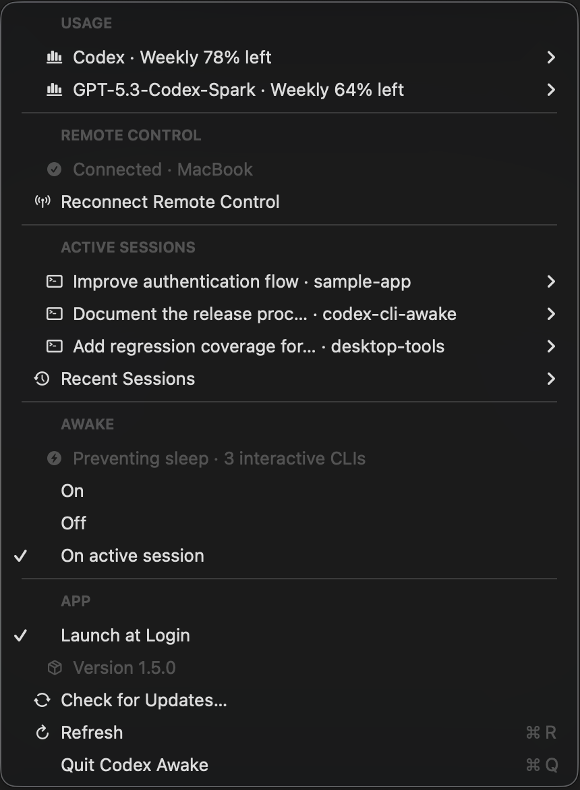
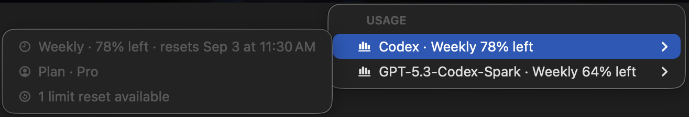
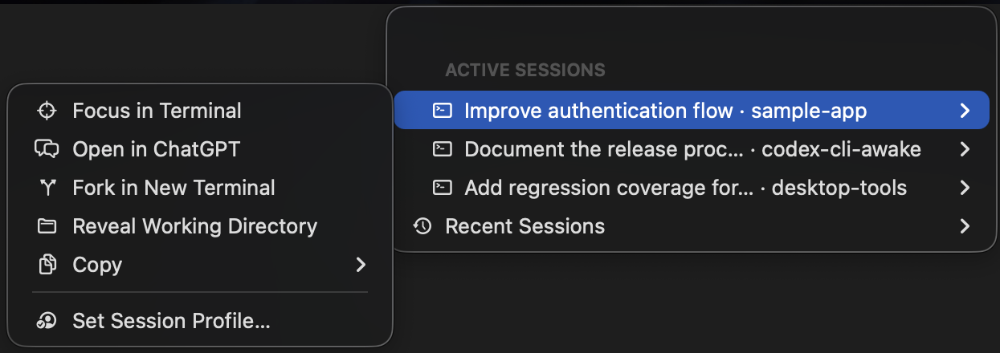

# Codex CLI Awake

[](https://github.com/stslex/codex-cli-awake/actions/workflows/build.yml)
[](https://www.apple.com/macos/)
[](https://www.swift.org/)
[](LICENSE)

A small native macOS menu-bar companion for Codex CLI. It keeps long-running CLI work awake, coordinates the local Remote Control owner, and makes active and recent sessions visible without opening another full application.

- Registers itself as a native macOS Login Item and can keep CLI Remote Control connected after wake or transient network loss.
- Switches the saved Remote Control source between Terminal CLI and Codex Desktop without competing for the single host connection.
- Prevents idle system sleep always, never, or only while an interactive Codex CLI session is active.
- Shows current account rate-limit usage, including separate model-specific windows when Codex reports them.
- Shows named active sessions immediately, keeps recent sessions in a nested menu, and provides safe per-session actions, including returning to the exact terminal that owns a live CLI session.
- Checks its public GitHub Releases feed for updates without analytics, a privileged helper, or a root component.

## Quick start

```bash
git clone https://github.com/stslex/codex-cli-awake.git
cd codex-cli-awake
./scripts/install.sh
```

The installer builds an ad-hoc signed app, copies it to `~/Applications/Codex Awake.app`, registers it with macOS Service Management, and starts it immediately. The default Awake mode for a new installation is **On active session**. If Service Management is unavailable for a source build, the installer keeps a compatibility LaunchAgent as a fail-safe and reports that choice.

### Distribution status

Source installation is the supported path until the first Developer ID-signed and Apple-notarized GitHub release is published. The repository already contains the universal release pipeline, native updater, and Homebrew Cask generator, but it intentionally does not publish an ad-hoc signed binary. Until that first release exists, the update menu reports **No published release**.

After the first signed release and public tap are available, users can update from the app when it is installed in a writable location such as `~/Applications`, or use Homebrew:

```bash
brew tap stslex/tap
brew install --cask codex-cli-awake
```

Do not treat that command as available until the tap is linked from this README or the GitHub Releases page contains a notarized asset.

## Menu

The menu is arranged in five sections:

1. **Usage** — account-wide Codex rate-limit windows and the percentage remaining in each one.
2. **Remote Control** — a saved Terminal CLI / Codex Desktop source selector, connection ownership state, and the action appropriate for that source.
3. **Active Sessions** — interactive CLI/TUI sessions matched to a live TTY are shown immediately; inactive user threads stay in the nested **Recent Sessions** menu.
4. **Awake** — the current power assertion and the three sleep-prevention modes.
5. **App** — the saved Rejoin terminal, native Launch at Login state, installed version, update status and action, manual refresh, and quit.



The forced-white menu-bar icon combines a terminal with a small cloud in its upper-right corner. The terminal body fills while Codex Awake owns a power assertion. The cloud shows the Terminal CLI connection state; when Codex Desktop is selected, its own UI remains the authority for the live connection state.

## Usage limits

The top of the menu reads the authenticated account snapshot exposed by the locally installed Codex app server. It shows the most constrained window for each reported limit, such as the general Codex limit and a model-specific limit. Open a row to see every five-hour, weekly, or other window, plus the plan, credit balance, reset time, and any available rate-limit reset.



Usage refreshes at launch, every five minutes, whenever the menu opens with data older than one minute, and when **Refresh** is selected. A failed or unauthenticated request stays visible as **Usage unavailable** without affecting Remote Control, session detection, or Awake mode. These values are account-wide server counters; they are not estimates derived from this Mac's local session logs.

## Session actions

Each active or recent session opens a native submenu instead of launching a command immediately:



- **Focus in Terminal** returns to the exact Ghostty, Terminal, or iTerm2 surface that owns an active CLI process.
- **Rejoin in Ghostty/Terminal/iTerm2** is offered when Focus confirms that the original surface no longer exists. It connects a new TUI to the same running thread through the shared app server without stopping the existing Codex process.
- **Open in ChatGPT** opens the exact `codex://threads/<session-id>` deep link.
- **Resume in Terminal** is available only for recent sessions; active sessions use the explicit Rejoin fallback instead.
- **Fork in New Terminal** creates an independent continuation of an active or recent session.
- **Reveal Working Directory** opens the session directory in Finder.
- **Copy** exposes the session name, ID, working directory, and ChatGPT deep link.
- **Archive Session** is available only for recent sessions and always requires confirmation. Delete and Stop actions are intentionally not exposed.

Focus matches the active Codex process to its TTY before activating a terminal surface. Terminal and iTerm2 expose that TTY directly. For Ghostty, Codex Awake briefly assigns a unique title to the exact TTY, focuses the one matching surface through Ghostty's native AppleScript interface, and immediately restores the previous title. It never guesses between ambiguous active processes. If the process is still alive but its exact surface has disappeared, Codex Awake asks before rejoining the running thread in the terminal selected under **App → Rejoin Terminal**. The selection is saved between launches; Ghostty and iTerm2 open a new tab, while Terminal opens a new Terminal window.

Rejoin launches the selected terminal. Resume and Fork continue to launch the built-in Terminal app. macOS may ask once for permission to let Codex Awake control Ghostty, Terminal, or iTerm2.

### Per-session profiles

Resume and Fork preserve the selected session's CLI profile by rebuilding the command with the same `--profile <name>` before the subcommand. Codex thread metadata does not contain the profile name, so Codex Awake keeps a local session-ID-to-profile mapping in `UserDefaults`:

- While a CLI session is active, the app captures an explicit `--profile` or `-p` from its process command and remembers it.
- If an older recent session has no known mapping, the first Resume or Fork asks for its original profile and remembers the answer.
- **Default (no --profile)** is an explicit saved choice, never a silent fallback.
- **Profile: ...** in a session submenu lets you inspect or correct the saved choice.

The mapping changes only how Codex Awake launches future Resume and Fork commands. It does not rewrite the Codex thread or its transcript.

## Awake modes

| Mode | Behavior |
| --- | --- |
| **On** | Always holds a `PreventUserIdleSystemSleep` assertion. |
| **Off** | Releases the assertion owned by Codex Awake. |
| **On active session** | Holds the assertion while an interactive Codex CLI/TUI process is present. |

The selected mode is stored in `UserDefaults` and restored after login. `On active session` checks the local process list every three seconds. It detects interactive `codex` processes with a TTY, including `codex --remote unix://`, and ignores app servers, Remote Control helpers, MCP servers, code-mode hosts, and non-interactive commands.

Codex Awake uses a native IOKit power assertion. It does not prevent display sleep or modify global Energy Saver settings.

## Remote Control source

**Terminal CLI** is the default source. In this mode Codex Awake runs the idempotent `codex remote-control start --json` command every ten seconds. This keeps the managed CLI host connected after login, wake, or a transient network interruption.

Choose **Remote Control > Source > Codex Desktop** to hand ownership to the desktop app. Codex Awake warns before running `codex remote-control stop --json`, because stopping the shared CLI daemon can disconnect attached TUI clients. It then stops all automatic CLI start attempts, remembers the Desktop source, and opens Codex so you can enable **Settings > Connections > Control this Mac > Allow connections**. If that setting was already enabled while the CLI owned the host, toggle it off and on once so Desktop retries after the host is released.

To return, first turn off **Allow connections** in Codex Desktop and choose **Terminal CLI**. Codex Awake immediately resumes the normal CLI start/reconnect loop. If Desktop still owns the host, the menu reports the ownership conflict instead of trying to change Desktop's private settings.

The **Launch at Login** menu item exposes the actual Service Management state. If macOS requires approval, it opens **System Settings > General > Login Items**. Turning the item off unregisters only Codex Awake; it does not stop Remote Control or any attached CLI/TUI session.

For Terminal CLI, the menu exposes **Start / Reconnect Remote Control**. For Codex Desktop, it exposes **Open Codex Remote Settings…**. A general-purpose Stop action remains unavailable; shutdown is used only by the explicitly confirmed Terminal-to-Desktop handoff.

Only one app can own the Remote host connection. The source selector prevents Codex Awake from continuously reclaiming the CLI host while Codex Desktop is selected. The app intentionally uses the supported CLI command and the public Desktop settings flow instead of editing Codex Desktop's private database or IPC state.

See the official [Remote connections documentation](https://learn.chatgpt.com/docs/remote-connections) for account, workspace, network, sleep, and mobile requirements.

## Requirements

- macOS 13 or later
- A Codex CLI version that provides `remote-control` and managed `app-server daemon` commands
- A Codex app-server version that provides the read-only `account/rateLimits/read` method for the Usage section
- Xcode Command Line Tools or Xcode with Swift 5.9 or later to build from source

## Build without installing

```bash
./scripts/build.sh
./scripts/build.sh release --universal
```

The app bundle is written to `build/Codex Awake.app`. The first command builds for the current Mac; `--universal` builds one `arm64` and `x86_64` bundle.

The build also renders the code-native application artwork into a complete macOS `.icns` resource. The same terminal-and-cloud icon is assigned explicitly to native alerts, including update dialogs.

Command-line diagnostics are available from the built executable:

```bash
./build/Codex\ Awake.app/Contents/MacOS/CodexAwake --detect-sessions
./build/Codex\ Awake.app/Contents/MacOS/CodexAwake --remote-status
./build/Codex\ Awake.app/Contents/MacOS/CodexAwake --usage
./build/Codex\ Awake.app/Contents/MacOS/CodexAwake --list-active-sessions
./build/Codex\ Awake.app/Contents/MacOS/CodexAwake --list-sessions
./build/Codex\ Awake.app/Contents/MacOS/CodexAwake --remote-start
./build/Codex\ Awake.app/Contents/MacOS/CodexAwake --check-for-updates
./build/Codex\ Awake.app/Contents/MacOS/CodexAwake --login-item-status
./build/Codex\ Awake.app/Contents/MacOS/CodexAwake --register-login-item
./build/Codex\ Awake.app/Contents/MacOS/CodexAwake --unregister-login-item
```

`--detect-sessions`, `--list-active-sessions`, and `--list-sessions` are local read-only commands. `--usage` asks the authenticated local Codex app server for the current account rate-limit snapshot. `--check-for-updates` makes a read-only request to this repository's latest GitHub Release. `--remote-status` and `--remote-start` are explicit Terminal CLI diagnostics: both ensure that CLI Remote Control is started before returning its status and do not change the source saved by the menu app.

## Verify the installation

```bash
~/Applications/Codex\ Awake.app/Contents/MacOS/CodexAwake --login-item-status
pmset -g assertions
```

The Login Item command reports `enabled` when native login start is active. When Codex Awake is holding the assertion, `pmset` lists a `CodexAwake` process with the assertion name `Codex Awake menu-bar mode`.

## Uninstall

```bash
./scripts/uninstall.sh
```

Use `./scripts/uninstall.sh --purge` to remove the saved mode as well.

## Important behavior

- **Off** releases only the assertion created by Codex Awake. Other applications can independently prevent sleep.
- ChatGPT's **Keep this Mac awake** setting is separate from this app.
- Closing the MacBook lid still follows macOS clamshell rules.
- Active-session candidates come from user rollout files held open by the managed app-server, then must match a live interactive Codex process by explicit session ID or working directory. When multiple loaded threads share a directory, the newest matching thread is active; older threads remain recent. Service and sub-agent rollouts are excluded.
- Session names and working directories come from the local Codex state database and remain on the Mac.
- Per-session profile selections are stored locally in the Codex Awake `UserDefaults` domain and are not written into Codex thread metadata.
- The installer removes the obsolete standalone `com.stslex.codex-remote-control` LaunchAgent so Codex Awake is the only login-start coordinator. The saved source decides whether it owns the CLI connection or leaves ownership to Codex Desktop.

## Releases and updates

Tagged releases are built once in GitHub Actions as a universal app, signed with Developer ID, notarized and stapled by Apple, checked by Gatekeeper, checksummed, and attested before a GitHub Release can be created. Missing credentials or any failed verification stops publication.

Codex Awake performs a quiet update check shortly after launch and no more than once every six hours while it remains open. It never downloads or installs an update automatically. When a newer release is available, choose **Install Update ...** in the menu and confirm the operation.

The native updater has no third-party framework or privileged helper. It accepts only the exact immutable ZIP and SHA-256 assets for a stable semantic-version tag in `stslex/codex-cli-awake`, verifies the checksum, bundle identifier, version, code signature, and Gatekeeper assessment, then stages the app beside the current bundle. A short-lived copy of the new signed executable waits for Codex Awake to quit, keeps a rollback copy during replacement, relaunches the new app, and restores the previous bundle if relaunch fails. It does not stop CLI sessions or the selected Remote Control owner.

Self-update requires the app's parent directory to be writable. A source-built ad-hoc copy can migrate to the signed release even when both have the same semantic version. Homebrew-managed or administrator-owned installations should continue to use `brew upgrade --cask codex-cli-awake`; the in-app action fails without modifying the existing app when replacement is not permitted. See [RELEASING.md](RELEASING.md), [ADR-0001](docs/adr/0001-signed-releases-and-homebrew.md), and [ADR-0002](docs/adr/0002-native-self-updater.md).

## Privacy and security

Codex Awake has no analytics, privileged helper, or root component. It reads the local process list and Codex state database, calls the public IOKit power-management API, and invokes the locally installed Codex CLI for Usage, Terminal Remote Control, and explicit session actions. When Codex Desktop is selected, Desktop owns Remote Control traffic, authentication, and connection status. The only network request made directly by Codex Awake is an unauthenticated HTTPS request to GitHub for release metadata and, after explicit installation confirmation, the selected release archive and checksum.

## Contributing

Issues and pull requests are welcome. Please run `swift build` and `./scripts/build.sh` before submitting a change. For privacy-safe documentation screenshots, launch the built app with `--screenshot-preview`, `--screenshot-preview-usage`, or `--screenshot-preview-session`; each mode opens the real native menu with deterministic sample data instead of local thread names and paths.

## License

MIT
